# DevOps CI/CD 


A production-ready Node.js application with a complete CI/CD pipeline using Docker, Nginx, and GitHub Actions.

## 🚀 Features

- **Node.js Express App**: With health checks and graceful shutdown.
- **Dockerized**: specific multi-stage builds for small, secure images.
- **Nginx Reverse Proxy**: For load balancing and security headers.
- **Zero Downtime Deployment**: Uses Docker Swarm rolling updates.
- **CI/CD**: Automated testing, building, and deployment via GitHub Actions.

## 📂 Project Structure

```
├── .github/workflows/   # CI/CD Pipeline
├── app/                 # Node.js Application
│   ├── src/             # Source code
│   └── test/            # Unit tests
├── nginx/               # Nginx Configuration
├── Dockerfile           # Docker Production Build
└── docker-compose.yml   # Docker Swarm Stack
```

## 📊 CI/CD Workflow

This diagram visualizes the automated pipeline triggered by every push to `main`:

```mermaid
sequenceDiagram
    participant User as 👩‍💻 Developer
    participant GitHub as 🐙 GitHub Repo
    participant Actions as ⚙️ GitHub Actions (CI)
    participant DockerHub as 🐳 Docker Hub
    participant Server as 🖥️ Production Server

    User->>GitHub: git push origin main
    activate GitHub
    GitHub->>Actions: Trigger 'build-and-test'
    activate Actions
    
    Note over Actions: npm install<br/>npm test
    Actions-->>Actions: Tests Pass ✅
    
    Actions->>Actions: docker build
    Actions->>DockerHub: docker push (new image)
    deactivate Actions
    
    GitHub->>Actions: Trigger 'deploy' (CD)
    activate Actions
    
    Actions->>Server: SSH Connect
    activate Server
    
    Note over Server: Pull & Update
    Server->>DockerHub: docker pull
    DockerHub-->>Server: Download Image
    
    Server->>Server: docker stack deploy
    Note over Server: Zero Downtime Rolling Update 🔄
    
    Server-->>Actions: Success
    deactivate Server
    deactivate Actions
    deactivate GitHub
```



### 🔄 How the Automation Works

1.  **Code Change**: You modify the code and `git push origin main`.
2.  **CI Trigger**: GitHub Actions automatically starts the `build-and-test` job.
    -   It installs dependencies and runs `npm test`.
    -   If valid, it builds a Docker image and pushes it to Docker Hub.
3.  **CD Deployment**: The `deploy` job connects to your server via SSH.
    -   It pulls the new image.
    -   It runs `docker stack deploy` to perform a **Zero-Downtime Rolling Update**.
    -   Users stay online while the new version gradually replaces the old one.

## 🛠️ Prerequisites

- A Linux Server (Ubuntu 20.04/22.04 recommended)
- Docker & Docker Compose installed on the server
- A GitHub Repository
- Docker Hub Account

## ⚙️ Setup Instructions

### 1. Server Setup

SSH into your server and install Docker:

```bash
# Update and install Docker
curl -fsSL https://get.docker.com -o get-docker.sh
sh get-docker.sh

# Initialize Docker Swarm
docker swarm init
```

### 2. GitHub Secrets

Go to your Repository Settings > Secrets and Variables > Actions, and add:

- `DOCKER_USERNAME`: Your Docker Hub username.
- `DOCKER_PASSWORD`: Your Docker Hub access token.
- `SERVER_HOST`: IP address of your VPS.
- `SERVER_USER`: Username (e.g., `root` or `ubuntu`).
- `SSH_PRIVATE_KEY`: Your private SSH key (OpenSSH format).

### 3. Deploy

1. Copy `docker-compose.yml` and `nginx/` folder to your server:
   ```bash
   scp docker-compose.yml user@host:~/devops-project/
   scp -r nginx user@host:~/devops-project/
   ```

2. Push code to the `main` branch.
3. Watch the Actions tab in GitHub!

## 🔄 How Zero Downtime Works

We use **Docker Swarm** for orchestration. The `docker-compose.yml` defines a `deploy` configuration:

```yaml
deploy:
  replicas: 2
  update_config:
    order: start-first
```

When a new image is deployed:
1. Swarm starts a NEW container with the new image.
2. It waits for the Health Check to pass.
3. Once healthy, it directs traffic to the new container.
4. Only then does it shut down the old container.

## 👨‍💻 Local Development

```bash
cd app
npm install
npm start
```
